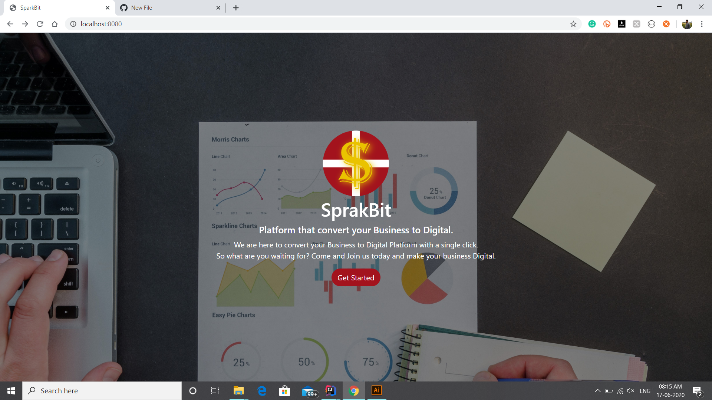
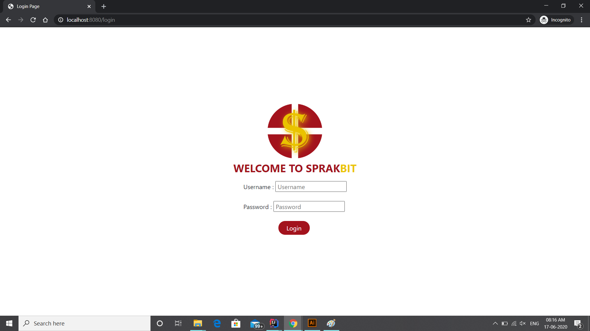
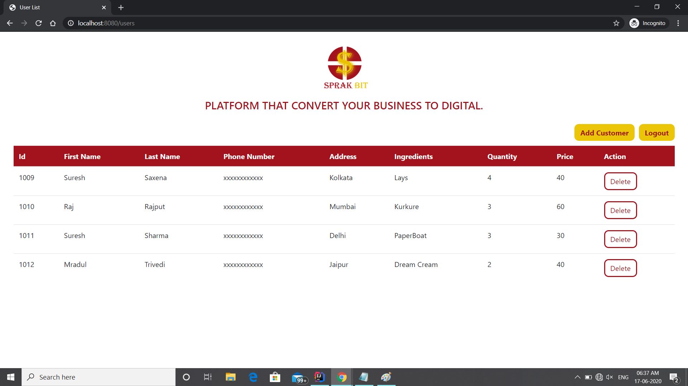
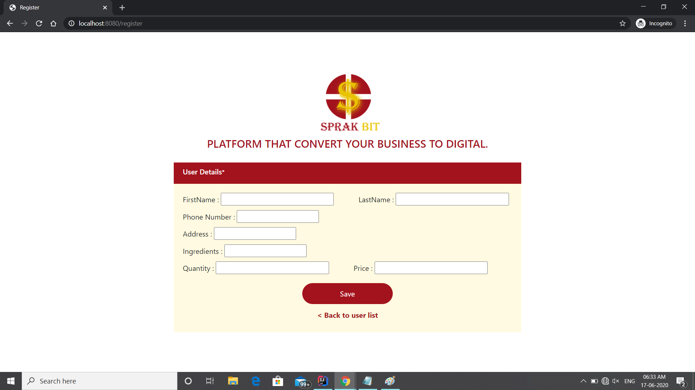
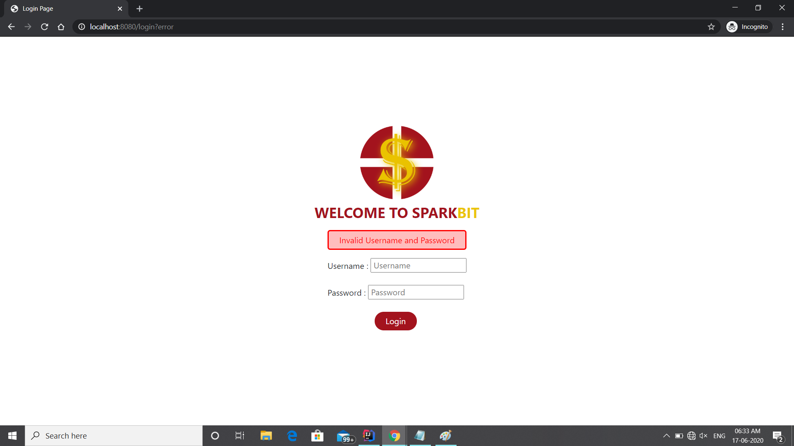
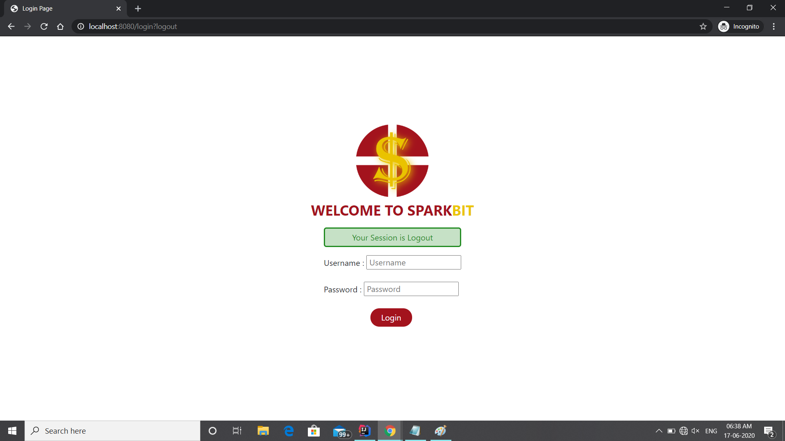
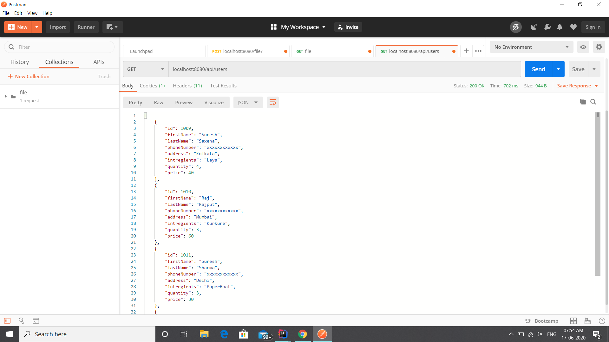
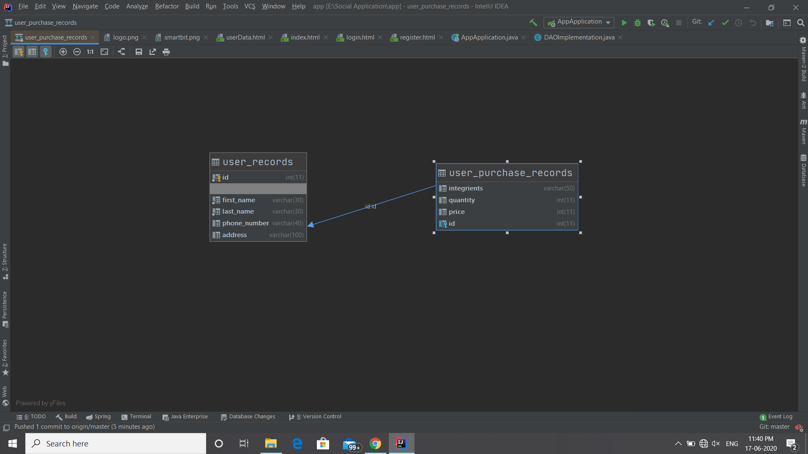
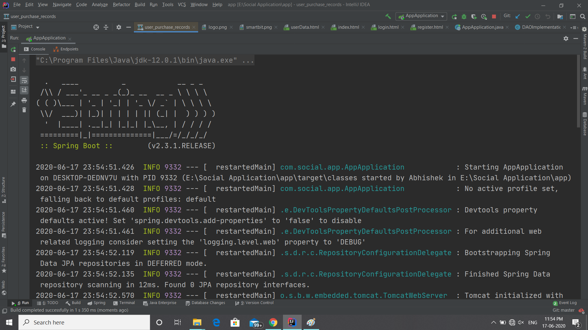

# SprakBit - SpringBoot Application :computer: 

SprakBit is web based application design and developed using Bootstrap and SpringBoot. It is used to manage the customer records online with the BCrypt password encoder security and a user-friendly user interface. As it is responsive, user can manage thier customer from any device. No need to implement special type setup to use the application.

## Features :fire:
* Add new customer
* Delete the customer
* Login
* Logout

## Screenshots :camera:

### Main Page

### Login Page

### User List Page

### Add New Customer

### Error Page

### Logout Page

## Technology Used :globe_with_meridians:
* SpringBoot
* Spring MVC
* Spring Hibernate
* Spring Security
* Spring Rest
* MySQL
* HTML
* CSS

## Tools Used :wrench:
* IntelliJ IDEA
* Github
* Maven
* Postman

## RestFul API

## Database Structure
For storing the user records in two different tables bind with the One-to-One Mapping with the Foriegn Key <b>id</b>, makes the database structure clean.

## Server View

## About the Developer

Connect me on Linkedin [here](https://www.linkedin.com/mwlite/in/abhishek-vaish) :heart:

